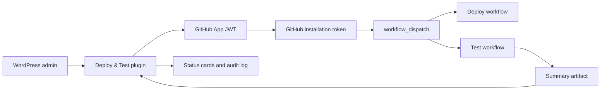

# Deploy & Test

Deploy & Test is a WordPress admin plugin for developers and small teams that deploy sites with GitHub Actions. It lets trusted WordPress users trigger configured deploy and test workflows without giving them GitHub access or personal access tokens.

This is a public portfolio/reference project. It is not currently managed as an open contribution project, but forks are welcome under the license.

[](https://github.com/MCaius/deploy-and-test-wordpress-plugin/actions/workflows/ci.yml)
[](https://github.com/MCaius/deploy-and-test-wordpress-plugin/actions/workflows/release.yml)
[](https://github.com/MCaius/deploy-and-test-wordpress-plugin/releases/latest)


## Why

Small WordPress teams often use GitHub Actions for deploys and automated testing, but those workflows usually stay hidden in GitHub or the terminal.

Deploy & Test brings controlled deploy buttons, test suite triggers, status checks, and audit logs into the WordPress admin, without exposing personal access tokens or requiring non-technical users to work inside GitHub.

## Use Case

- Give editors or site managers a controlled deploy button in WordPress.
- Trigger preview and production GitHub Actions workflows from the admin.
- Run configured test workflows from a separate testing repository.
- Keep GitHub credentials server-side through a GitHub App.
- Show recent deploy/test status and a small audit trail in WordPress.

## Features

- WordPress admin page with Deploy, Tests, Connection, and Audit log tabs.
- GitHub App authentication with short-lived installation tokens.
- Configurable repository owner, deploy repository, test repository, refs, workflow filenames, and target labels.
- Preview and production deploy actions.
- Configurable test action buttons and test environments.
- Recent workflow run status cards with polling while actions are active.
- Test summary artifact display for compact JSON reports.
- Audit log stored in WordPress options and limited to the latest 100 entries.
- Optional uninstall cleanup for settings, audit logs, locks, and cached test summaries.

## Architecture



## Requirements

- WordPress 6.0 or newer.
- PHP 7.4 or newer.
- A GitHub App installed on the repositories used by the deploy/test flow.
- GitHub Actions workflows that support `workflow_dispatch`.
- `ZipArchive` on the WordPress server if you want WordPress to read test summary artifacts.

## Install

1. Upload the `deploy-and-test` folder to `wp-content/plugins/`.
2. Activate `Deploy & Test` in WordPress.
3. Create and install a GitHub App with `Actions: Read and write`.
4. Add the GitHub App constants to `wp-config.php`.
5. Configure repository and workflow settings in `Deploy & Test -> Connection`.

For detailed setup instructions, GitHub App settings, workflow examples, and test summary format, see [HOW-TO-USE.md](HOW-TO-USE.md).

## Build Upload Zip

Run:

```bash
npm run build:zip
```

This creates:

```text
dist/deploy-and-test.zip
```

Upload that zip manually in WordPress:

```text
Plugins -> Add New Plugin -> Upload Plugin
```

The zip contains only the `deploy-and-test/` plugin folder and runtime plugin files. Repository docs, scripts, generated manifests, `vendor/`, and local config are not included.

## Development Checks

Install the PHP tooling:

```bash
composer install
```

Run WordPress Coding Standards checks:

```bash
composer lint:php
```

Build the upload zip:

```bash
npm run build:zip
```

The CI workflow runs the same lint/build steps.

## Security Model

- The plugin does not push code.
- The plugin triggers GitHub Actions workflow dispatches on configured refs.
- WordPress Editors are allowed to trigger configured deploy and test actions. This is intentional for teams that want non-technical WordPress users to run approved workflows without granting WordPress administrator access or GitHub access.
- Only WordPress Administrators can change plugin configuration, GitHub repository settings, workflow filenames, test actions, cleanup settings, or view the audit log.
- GitHub App private keys are read from `wp-config.php` constants, not stored in the database.
- WordPress generates short-lived GitHub installation tokens server-side when actions run.
- Admin POST/AJAX handlers use capability checks and nonces.
- Audit logs are stored in `wp_options` under `deploy_and_test_audit_log`.

## Limitations

- This plugin assumes a GitHub Actions based deploy process already exists.
- It is aimed at developer-managed WordPress sites, not general-purpose WordPress users.
- It does not create GitHub workflow files for you.
- It does not manage GitHub App installation or repository permissions automatically.
- It is not currently maintained as an open contribution project.

## License

GPL-2.0-or-later. See `LICENSE`.
